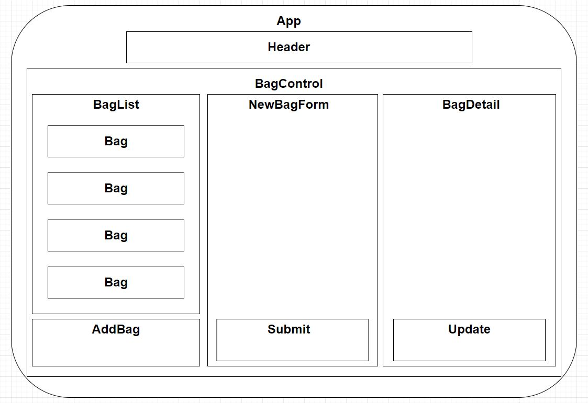

# **Inventory Tracker**

### By _Max Betich_

## Technologies Used

* _HTML_
* _CSS_
* _Bootstrap, React-Bootstrap_
* _Javascript_
* _Lint_
* _Node_
* _React_
* _Create-React-App_

## Description
This application allows the user to add and track the state of products added to their site using React to dynamically update the webpage. It features the ability to create, read, update, and delete inventory elements by clicking on list items and viewing the relevant details for that item.

## Setup/Installation Requirements
 * Clone project from this [Github repository](https://github.com/MaxBetich/inventory-tracker.git) to your desktop.
 * Navigate to the top level of the "inventory-tracker" directory in your terminal.
 * Run the command "npm install" in your terminal.
 * Run the command "npm run start" to launch the page in your default web browser.

## Component List

## Known Bugs

None

## License

MIT

Copyright (c) _2023_ _Max Betich_